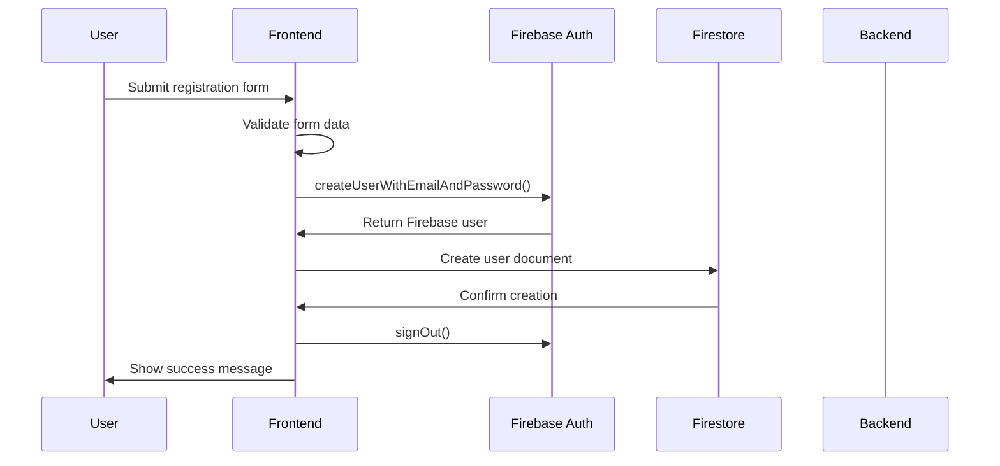

# User Registration Sequence Diagram

```mermaid
sequenceDiagram
    participant U as User
    participant F as Frontend
    participant FA as Firebase Auth
    participant FS as Firestore
    participant B as Backend

    U->>F: Submit registration form
    F->>F: Validate form data
    F->>FA: createUserWithEmailAndPassword()
    FA->>F: Return Firebase user
    F->>FS: Create user document
    FS->>F: Confirm creation
    F->>FA: signOut()
    F->>U: Show success message
```
