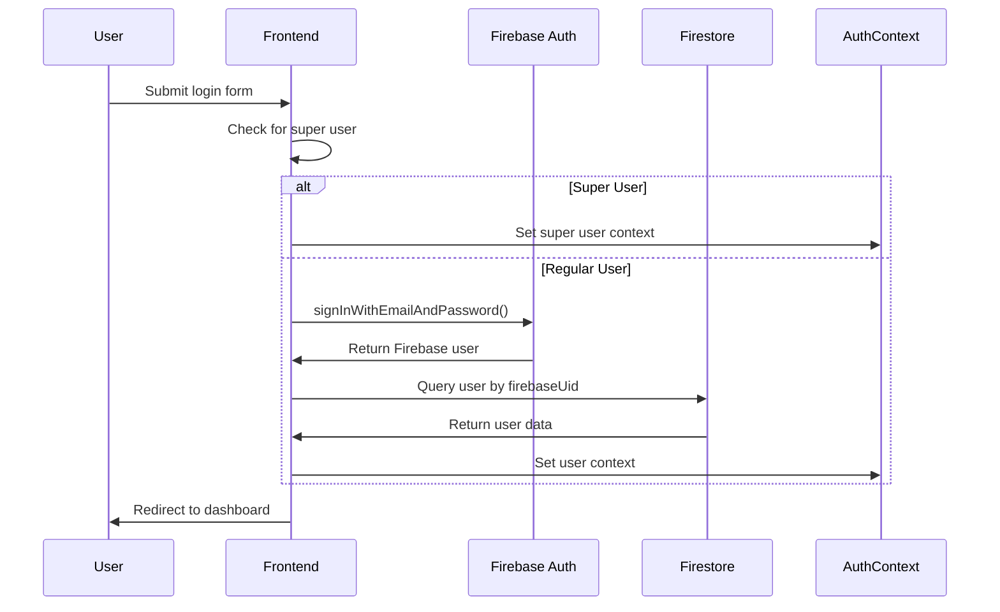

# Login Sequence Diagram

```mermaid
sequenceDiagram
    participant U as User
    participant F as Frontend
    participant FA as Firebase Auth
    participant FS as Firestore
    participant C as AuthContext

    U->>F: Submit login form
    F->>F: Check for super user
    alt Super User
        F->>C: Set super user context
    else Regular User
        F->>FA: signInWithEmailAndPassword()
        FA->>F: Return Firebase user
        F->>FS: Query user by firebaseUid
        FS->>F: Return user data
        F->>C: Set user context
    end
    F->>U: Redirect to dashboard
```
