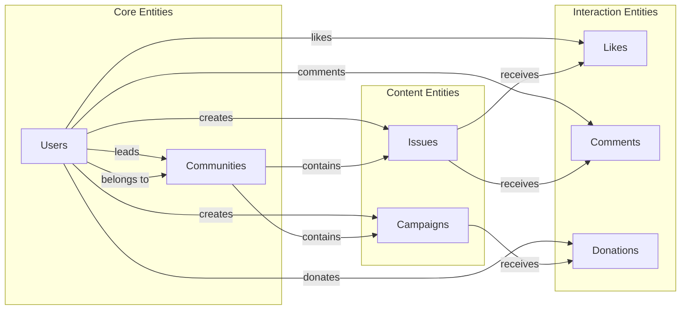

# Database Schema Overview

```mermaid
graph LR
    subgraph "Core Entities"
        U[Users]
        C[Communities]
    end

    subgraph "Content Entities"
        I[Issues]
        CAM[Campaigns]
    end

    subgraph "Interaction Entities"
        L[Likes]
        COM[Comments]
        D[Donations]
    end

    U -->|creates| I
    U -->|creates| CAM
    U -->|likes| L
    U -->|comments| COM
    U -->|donates| D
    U -->|leads| C
    U -->|belongs to| C
    
    C -->|contains| I
    C -->|contains| CAM
    
    I -->|receives| L
    I -->|receives| COM
    
    CAM -->|receives| D
```
