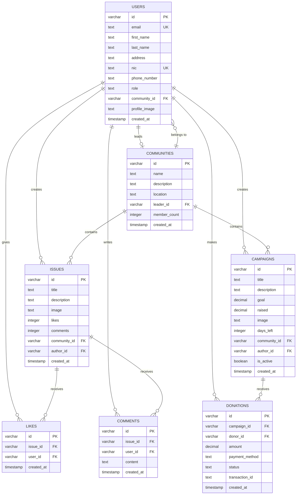

# Entity Relationship Diagram

```mermaid
erDiagram
    USERS {
        varchar id PK
        text email UK
        text first_name
        text last_name
        text address
        text nic UK
        text phone_number
        text role
        varchar community_id FK
        text profile_image
        timestamp created_at
    }

    COMMUNITIES {
        varchar id PK
        text name
        text description
        text location
        varchar leader_id FK
        integer member_count
        timestamp created_at
    }

    ISSUES {
        varchar id PK
        text title
        text description
        text image
        integer likes
        integer comments
        varchar community_id FK
        varchar author_id FK
        timestamp created_at
    }

    CAMPAIGNS {
        varchar id PK
        text title
        text description
        decimal goal
        decimal raised
        text image
        integer days_left
        varchar community_id FK
        varchar author_id FK
        boolean is_active
        timestamp created_at
    }

    DONATIONS {
        varchar id PK
        varchar campaign_id FK
        varchar donor_id FK
        decimal amount
        text payment_method
        text status
        text transaction_id
        timestamp created_at
    }

    LIKES {
        varchar id PK
        varchar issue_id FK
        varchar user_id FK
        timestamp created_at
    }

    COMMENTS {
        varchar id PK
        varchar issue_id FK
        varchar user_id FK
        text content
        timestamp created_at
    }

    USERS ||--o{ ISSUES : "creates"
    USERS ||--o{ CAMPAIGNS : "creates"
    USERS ||--o{ DONATIONS : "makes"
    USERS ||--o{ LIKES : "gives"
    USERS ||--o{ COMMENTS : "writes"
    USERS ||--o| COMMUNITIES : "leads"
    USERS }o--|| COMMUNITIES : "belongs to"
    
    COMMUNITIES ||--o{ ISSUES : "contains"
    COMMUNITIES ||--o{ CAMPAIGNS : "contains"
    
    ISSUES ||--o{ LIKES : "receives"
    ISSUES ||--o{ COMMENTS : "receives"
    
    CAMPAIGNS ||--o{ DONATIONS : "receives"
```
