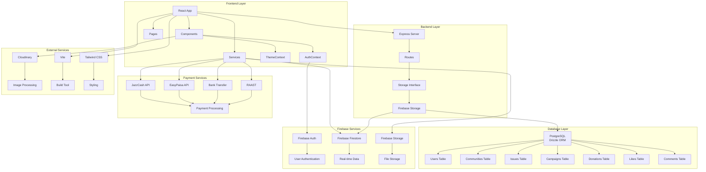

# System Architecture Diagram

```mermaid
graph TB
    subgraph "Frontend Layer"
        A[React App] --> B[Components]
        B --> C[AuthContext]
        B --> D[ThemeContext]
        A --> E[Pages]
        A --> F[Services]
    end

    subgraph "Backend Layer"
        G[Express Server] --> H[Routes]
        H --> I[Storage Interface]
        I --> J[Firebase Storage]
    end

    subgraph "Database Layer"
        K[PostgreSQL<br/>Drizzle ORM] --> L[Users Table]
        K --> M[Communities Table]
        K --> N[Issues Table]
        K --> O[Campaigns Table]
        K --> P[Donations Table]
        K --> Q[Likes Table]
        K --> R[Comments Table]
    end

    subgraph "Firebase Services"
        S[Firebase Auth] --> T[User Authentication]
        U[Firebase Firestore] --> V[Real-time Data]
        W[Firebase Storage] --> X[File Storage]
    end

    subgraph "Payment Services"
        Y[JazzCash API] --> Z[Payment Processing]
        AA[EasyPaisa API] --> Z
        BB[Bank Transfer] --> Z
        CC[RAAST] --> Z
    end

    subgraph "External Services"
        DD[Cloudinary] --> EE[Image Processing]
        FF[Vite] --> GG[Build Tool]
        HH[Tailwind CSS] --> II[Styling]
    end

    A --> G
    C --> S
    F --> U
    F --> W
    F --> Y
    F --> AA
    F --> BB
    F --> CC
    J --> K
    J --> U
    B --> DD
    A --> FF
    A --> HH
```
