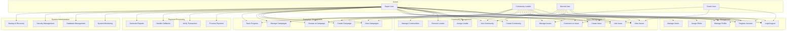

# Use Case Diagram

```mermaid
graph TB
    subgraph "Actors"
        SU[Super User]
        CL[Community Leader]
        NU[Normal User]
        GU[Guest User]
    end

    subgraph "User Management"
        UC1[Register Account]
        UC2[Login/Logout]
        UC3[Manage Profile]
        UC4[Assign Roles]
        UC5[Manage Users]
    end

    subgraph "Community Management"
        UC6[Create Community]
        UC7[Join Community]
        UC8[Assign Leader]
        UC9[Remove Leader]
        UC10[Manage Communities]
    end

    subgraph "Issue Management"
        UC11[Create Issue]
        UC12[View Issues]
        UC13[Like Issue]
        UC14[Comment on Issue]
        UC15[Manage Issues]
    end

    subgraph "Campaign Management"
        UC16[Create Campaign]
        UC17[View Campaigns]
        UC18[Donate to Campaign]
        UC19[Manage Campaigns]
        UC20[Track Progress]
    end

    subgraph "Payment Processing"
        UC21[Process Payment]
        UC22[Verify Transaction]
        UC23[Handle Callbacks]
        UC24[Generate Reports]
    end

    subgraph "System Administration"
        UC25[System Monitoring]
        UC26[Database Management]
        UC27[Security Management]
        UC28[Backup & Recovery]
    end

    %% Super User relationships
    SU --> UC1
    SU --> UC2
    SU --> UC3
    SU --> UC4
    SU --> UC5
    SU --> UC6
    SU --> UC7
    SU --> UC8
    SU --> UC9
    SU --> UC10
    SU --> UC11
    SU --> UC12
    SU --> UC13
    SU --> UC14
    SU --> UC15
    SU --> UC16
    SU --> UC17
    SU --> UC18
    SU --> UC19
    SU --> UC20
    SU --> UC21
    SU --> UC22
    SU --> UC23
    SU --> UC24
    SU --> UC25
    SU --> UC26
    SU --> UC27
    SU --> UC28

    %% Community Leader relationships
    CL --> UC1
    CL --> UC2
    CL --> UC3
    CL --> UC6
    CL --> UC7
    CL --> UC11
    CL --> UC12
    CL --> UC13
    CL --> UC14
    CL --> UC15
    CL --> UC16
    CL --> UC17
    CL --> UC18
    CL --> UC19
    CL --> UC20

    %% Normal User relationships
    NU --> UC1
    NU --> UC2
    NU --> UC3
    NU --> UC7
    NU --> UC12
    NU --> UC13
    NU --> UC14
    NU --> UC17
    NU --> UC18

    %% Guest User relationships
    GU --> UC2
    GU --> UC12
    GU --> UC17
```
