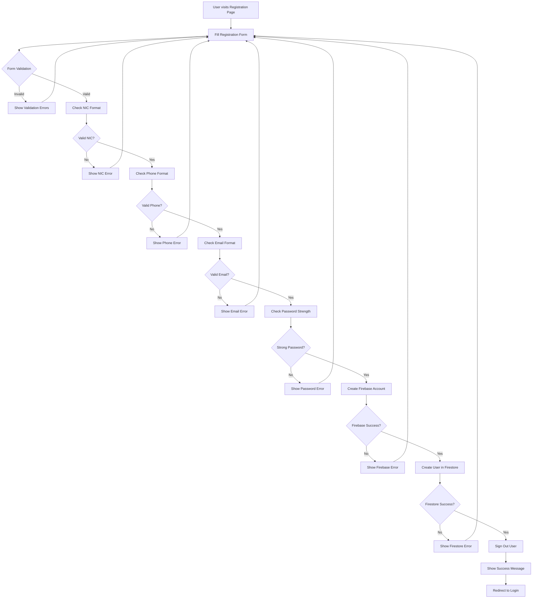

# User Registration Flow

```mermaid
flowchart TD
    A[User visits Registration Page] --> B[Fill Registration Form]
    B --> C{Form Validation}
    C -->|Invalid| D[Show Validation Errors]
    D --> B
    C -->|Valid| E[Check NIC Format]
    E --> F{Valid NIC?}
    F -->|No| G[Show NIC Error]
    G --> B
    F -->|Yes| H[Check Phone Format]
    H --> I{Valid Phone?}
    I -->|No| J[Show Phone Error]
    J --> B
    I -->|Yes| K[Check Email Format]
    K --> L{Valid Email?}
    L -->|No| M[Show Email Error]
    M --> B
    L -->|Yes| N[Check Password Strength]
    N --> O{Strong Password?}
    O -->|No| P[Show Password Error]
    P --> B
    O -->|Yes| Q[Create Firebase Account]
    Q --> R{Firebase Success?}
    R -->|No| S[Show Firebase Error]
    S --> B
    R -->|Yes| T[Create User in Firestore]
    T --> U{Firestore Success?}
    U -->|No| V[Show Firestore Error]
    V --> B
    U -->|Yes| W[Sign Out User]
    W --> X[Show Success Message]
    X --> Y[Redirect to Login]
```
