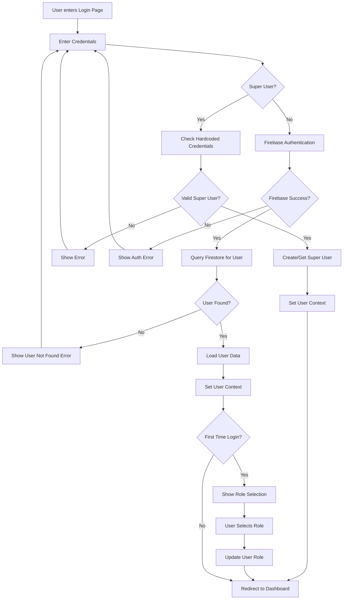

# User Authentication Flow

```mermaid
flowchart TD
    A[User enters Login Page] --> B[Enter Credentials]
    B --> C{Super User?}
    C -->|Yes| D[Check Hardcoded Credentials]
    D --> E{Valid Super User?}
    E -->|Yes| F[Create/Get Super User]
    F --> G[Set User Context]
    G --> H[Redirect to Dashboard]
    E -->|No| I[Show Error]
    I --> B
    C -->|No| J[Firebase Authentication]
    J --> K{Firebase Success?}
    K -->|No| L[Show Auth Error]
    L --> B
    K -->|Yes| M[Query Firestore for User]
    M --> N{User Found?}
    N -->|No| O[Show User Not Found Error]
    O --> B
    N -->|Yes| P[Load User Data]
    P --> Q[Set User Context]
    Q --> R{First Time Login?}
    R -->|Yes| S[Show Role Selection]
    S --> T[User Selects Role]
    T --> U[Update User Role]
    U --> H
    R -->|No| H
```
