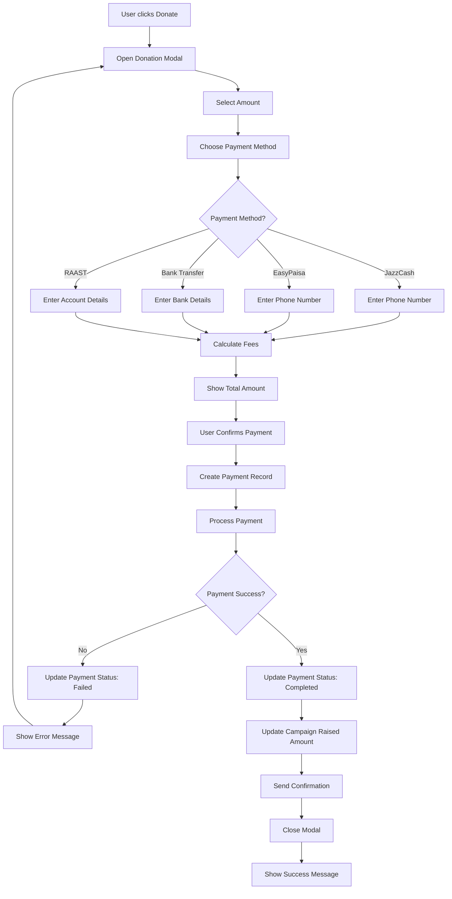

# Campaign Donation Flow

```mermaid
flowchart TD
    A[User clicks Donate] --> B[Open Donation Modal]
    B --> C[Select Amount]
    C --> D[Choose Payment Method]
    D --> E{Payment Method?}
    E -->|JazzCash| F[Enter Phone Number]
    E -->|EasyPaisa| G[Enter Phone Number]
    E -->|Bank Transfer| H[Enter Bank Details]
    E -->|RAAST| I[Enter Account Details]
    F --> J[Calculate Fees]
    G --> J
    H --> J
    I --> J
    J --> K[Show Total Amount]
    K --> L[User Confirms Payment]
    L --> M[Create Payment Record]
    M --> N[Process Payment]
    N --> O{Payment Success?}
    O -->|No| P[Update Payment Status: Failed]
    P --> Q[Show Error Message]
    Q --> B
    O -->|Yes| R[Update Payment Status: Completed]
    R --> S[Update Campaign Raised Amount]
    S --> T[Send Confirmation]
    T --> U[Close Modal]
    U --> V[Show Success Message]
```
