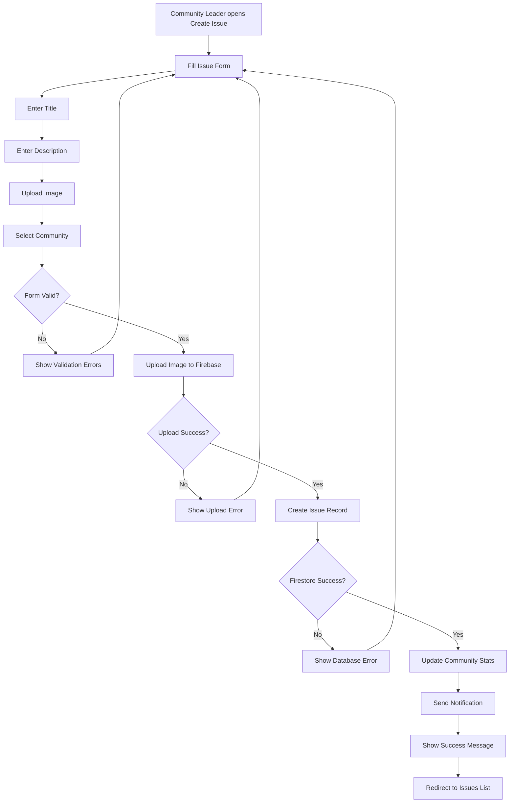

# Issue Creation Flow

```mermaid
flowchart TD
    A[Community Leader opens Create Issue] --> B[Fill Issue Form]
    B --> C[Enter Title]
    C --> D[Enter Description]
    D --> E[Upload Image]
    E --> F[Select Community]
    F --> G{Form Valid?}
    G -->|No| H[Show Validation Errors]
    H --> B
    G -->|Yes| I[Upload Image to Firebase]
    I --> J{Upload Success?}
    J -->|No| K[Show Upload Error]
    K --> B
    J -->|Yes| L[Create Issue Record]
    L --> M{Firestore Success?}
    M -->|No| N[Show Database Error]
    N --> B
    M -->|Yes| O[Update Community Stats]
    O --> P[Send Notification]
    P --> Q[Show Success Message]
    Q --> R[Redirect to Issues List]
```
