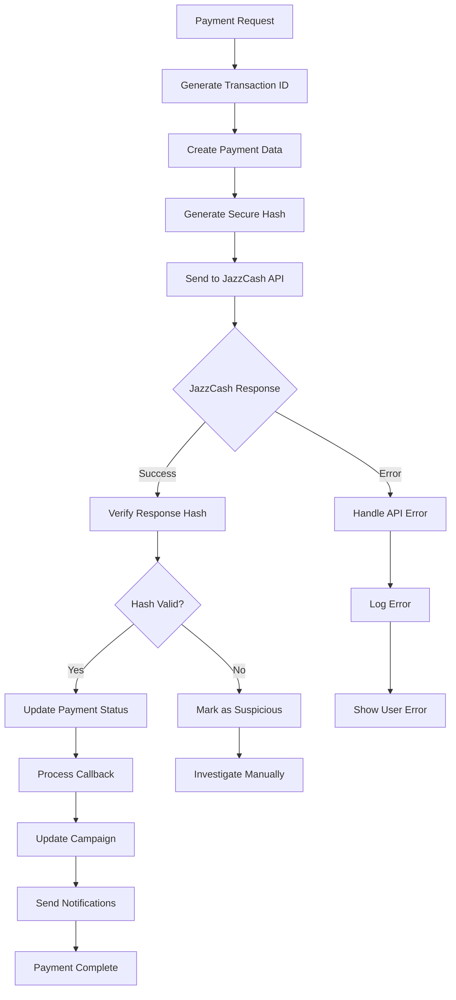

# Payment Processing Flow (JazzCash)

```mermaid
flowchart TD
    A[Payment Request] --> B[Generate Transaction ID]
    B --> C[Create Payment Data]
    C --> D[Generate Secure Hash]
    D --> E[Send to JazzCash API]
    E --> F{JazzCash Response}
    F -->|Success| G[Verify Response Hash]
    F -->|Error| H[Handle API Error]
    G --> I{Hash Valid?}
    I -->|Yes| J[Update Payment Status]
    I -->|No| K[Mark as Suspicious]
    J --> L[Process Callback]
    L --> M[Update Campaign]
    M --> N[Send Notifications]
    H --> O[Log Error]
    O --> P[Show User Error]
    K --> Q[Investigate Manually]
    N --> R[Payment Complete]
```
