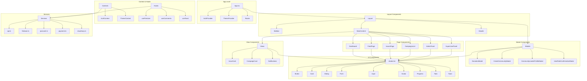

# Component Architecture Diagram

```mermaid
graph TB
    subgraph "App Level"
        APP[App.tsx] --> AUTH[AuthProvider]
        APP --> THEME[ThemeProvider]
        APP --> ROUTER[Router]
    end

    subgraph "Layout Components"
        LAYOUT[Layout] --> SIDEBAR[Sidebar]
        LAYOUT --> MAIN[MainContent]
        LAYOUT --> HEADER[Header]
    end

    subgraph "Page Components"
        MAIN --> DASH[Dashboard]
        MAIN --> FEED[FeedPage]
        MAIN --> ISSUES[IssuesPage]
        MAIN --> CAMPAIGNS[CampaignsList]
        MAIN --> ADMIN[AdminPanel]
        MAIN --> SUPER[SuperUserPanel]
    end

    subgraph "Modal Components"
        MODALS[Modals] --> DONATION[DonationModal]
        MODALS --> CREATE_COMM[CreateCommunityModal]
        MODALS --> LEADER_PROF[CommunityLeaderProfileModal]
        MODALS --> ROLE_CONF[UserRoleConfirmationModal]
    end

    subgraph "UI Components"
        UI[shadcn/ui] --> BUTTON[Button]
        UI --> CARD[Card]
        UI --> DIALOG[Dialog]
        UI --> FORM[Form]
        UI --> INPUT[Input]
        UI --> AVATAR[Avatar]
        UI --> PROGRESS[Progress]
        UI --> TABS[Tabs]
        UI --> TOAST[Toast]
    end

    subgraph "View Components"
        VIEWS[Views] --> ISSUE_CARD[IssueCard]
        VIEWS --> CAMPAIGN_CARD[CampaignCard]
        VIEWS --> NOTIFICATIONS[Notifications]
    end

    subgraph "Context & Hooks"
        CONTEXT[Contexts] --> AUTH_CTX[AuthContext]
        CONTEXT --> THEME_CTX[ThemeContext]
        HOOKS[Hooks] --> FIREBASE[useFirestore]
        HOOKS --> COMMENTS[useComments]
        HOOKS --> TOAST_HOOK[useToast]
    end

    subgraph "Services"
        SERVICES[Services] --> API[api.ts]
        SERVICES --> FIREBASE_SVC[firebase.ts]
        SERVICES --> JAZZCASH[jazzcash.ts]
        SERVICES --> PAYMENT[payment.ts]
        SERVICES --> CLOUDINARY[cloudinary.ts]
    end

    APP --> LAYOUT
    LAYOUT --> MODALS
    MAIN --> VIEWS
    DASH --> UI
    FEED --> UI
    ISSUES --> UI
    CAMPAIGNS --> UI
    ADMIN --> UI
    SUPER --> UI
    MODALS --> UI
    VIEWS --> UI
    CONTEXT --> SERVICES
    HOOKS --> SERVICES
```
