# CommunityConnect Platform - User Interaction Flow

```mermaid
graph TB
    %% User Types
    subgraph "User Roles"
        SU[Super Admin<br/>👑]
        CL[Community Leader<br/>👨‍💼]
        NU[Normal User<br/>👤]
    end

    %% Authentication Flow
    subgraph "Authentication"
        LOGIN[Login/Register]
        ROLE_SELECT[Role Selection]
        AUTH{Authentication<br/>Success?}
    end

    %% Super Admin Capabilities
    subgraph "Super Admin Functions"
        CREATE_COMM[Create Communities]
        MANAGE_USERS[Manage Users]
        ASSIGN_LEADERS[Assign Community Leaders]
        VIEW_ALL[View All Communities]
        DELETE_COMM[Delete Communities]
        GLOBAL_STATS[Global Statistics]
    end

    %% Community Leader Capabilities
    subgraph "Community Leader Functions"
        CREATE_ISSUES[Create Issues]
        CREATE_CAMPAIGNS[Create Campaigns]
        MANAGE_COMMUNITY[Manage Community]
        VIEW_COMMUNITY[View Community Stats]
        MANAGE_POSTS[Manage Posts & Content]
    end

    %% Normal User Capabilities
    subgraph "Normal User Functions"
        VIEW_FEED[View Community Feed]
        DONATE[Donate to Campaigns]
        COMMENT[Comment on Posts]
        LIKE_POSTS[Like Posts]
        REPORT_ISSUES[Report Issues]
        VIEW_PROFILES[View Leader Profiles]
    end

    %% Core Features
    subgraph "Core Platform Features"
        ISSUES[Community Issues<br/>📋]
        CAMPAIGNS[Fundraising Campaigns<br/>💰]
        DONATIONS[Payment Processing<br/>💳]
        NOTIFICATIONS[Notifications<br/>🔔]
        COMMENTS[Comments & Engagement<br/>💬]
    end

    %% Payment System
    subgraph "Payment Integration"
        JAZZCASH[JazzCash]
        EASYPAISA[EasyPaisa]
        BANK[Bank Transfer]
        RAAST[RAAST]
    end

    %% Database Collections
    subgraph "Database Structure"
        USERS_DB[(Users Collection)]
        COMMUNITIES_DB[(Communities Collection)]
        ISSUES_DB[(Issues Collection)]
        CAMPAIGNS_DB[(Campaigns Collection)]
        DONATIONS_DB[(Donations Collection)]
        COMMENTS_DB[(Comments Collection)]
    end

    %% User Flow Connections
    LOGIN --> AUTH
    AUTH -->|Success| ROLE_SELECT
    ROLE_SELECT --> SU
    ROLE_SELECT --> CL
    ROLE_SELECT --> NU

    %% Super Admin Flow
    SU --> CREATE_COMM
    SU --> MANAGE_USERS
    SU --> ASSIGN_LEADERS
    SU --> VIEW_ALL
    SU --> DELETE_COMM
    SU --> GLOBAL_STATS

    %% Community Leader Flow
    CL --> CREATE_ISSUES
    CL --> CREATE_CAMPAIGNS
    CL --> MANAGE_COMMUNITY
    CL --> VIEW_COMMUNITY
    CL --> MANAGE_POSTS

    %% Normal User Flow
    NU --> VIEW_FEED
    NU --> DONATE
    NU --> COMMENT
    NU --> LIKE_POSTS
    NU --> REPORT_ISSUES
    NU --> VIEW_PROFILES

    %% Feature Connections
    CREATE_ISSUES --> ISSUES
    CREATE_CAMPAIGNS --> CAMPAIGNS
    DONATE --> DONATIONS
    COMMENT --> COMMENTS
    LIKE_POSTS --> COMMENTS

    %% Payment Flow
    DONATIONS --> JAZZCASH
    DONATIONS --> EASYPAISA
    DONATIONS --> BANK
    DONATIONS --> RAAST

    %% Database Connections
    CREATE_COMM --> COMMUNITIES_DB
    MANAGE_USERS --> USERS_DB
    CREATE_ISSUES --> ISSUES_DB
    CREATE_CAMPAIGNS --> CAMPAIGNS_DB
    DONATE --> DONATIONS_DB
    COMMENT --> COMMENTS_DB

    %% Notifications
    CREATE_ISSUES --> NOTIFICATIONS
    CREATE_CAMPAIGNS --> NOTIFICATIONS
    DONATE --> NOTIFICATIONS
    COMMENT --> NOTIFICATIONS

    %% Styling
    classDef superAdmin fill:#ff6b6b,stroke:#d63031,stroke-width:3px,color:#fff
    classDef communityLeader fill:#4ecdc4,stroke:#00b894,stroke-width:3px,color:#fff
    classDef normalUser fill:#45b7d1,stroke:#0984e3,stroke-width:3px,color:#fff
    classDef features fill:#fdcb6e,stroke:#e17055,stroke-width:2px,color:#2d3436
    classDef payment fill:#a29bfe,stroke:#6c5ce7,stroke-width:2px,color:#fff
    classDef database fill:#fd79a8,stroke:#e84393,stroke-width:2px,color:#fff

    class SU,CREATE_COMM,MANAGE_USERS,ASSIGN_LEADERS,VIEW_ALL,DELETE_COMM,GLOBAL_STATS superAdmin
    class CL,CREATE_ISSUES,CREATE_CAMPAIGNS,MANAGE_COMMUNITY,VIEW_COMMUNITY,MANAGE_POSTS communityLeader
    class NU,VIEW_FEED,DONATE,COMMENT,LIKE_POSTS,REPORT_ISSUES,VIEW_PROFILES normalUser
    class ISSUES,CAMPAIGNS,DONATIONS,NOTIFICATIONS,COMMENTS features
    class JAZZCASH,EASYPAISA,BANK,RAAST payment
    class USERS_DB,COMMUNITIES_DB,ISSUES_DB,CAMPAIGNS_DB,DONATIONS_DB,COMMENTS_DB database
```

## How to Use This Diagram

1. **Copy the Mermaid code** from the code block above
2. **Paste it into any Mermaid-compatible tool** such as:
   - [Mermaid Live Editor](https://mermaid.live/)
   - GitHub (in markdown files)
   - Notion, Obsidian, or other tools that support Mermaid
   - VS Code with Mermaid extensions

## Diagram Features

- **Color-coded user roles**: Each user type has distinct colors
- **Interactive flow**: Shows how users move through the platform
- **Feature connections**: Links user actions to platform features
- **Database relationships**: Shows how data flows through the system
- **Payment integration**: Illustrates the multi-payment system

This diagram provides a comprehensive visual representation of how users, community leaders, and super admins interact within the CommunityConnect platform!
