# CommunityConnect Platform - User Interaction Flow

## Mermaid Diagram

```mermaid
graph TB
    %% User Types
    subgraph "User Roles"
        SU[Super Admin<br/>👑]
        CL[Community Leader<br/>👨‍💼]
        NU[Normal User<br/>👤]
    end

    %% Authentication Flow
    subgraph "Authentication"
        LOGIN[Login/Register]
        ROLE_SELECT[Role Selection]
        AUTH{Authentication<br/>Success?}
    end

    %% Super Admin Capabilities
    subgraph "Super Admin Functions"
        CREATE_COMM[Create Communities]
        MANAGE_USERS[Manage Users]
        ASSIGN_LEADERS[Assign Community Leaders]
        VIEW_ALL[View All Communities]
        DELETE_COMM[Delete Communities]
        GLOBAL_STATS[Global Statistics]
    end

    %% Community Leader Capabilities
    subgraph "Community Leader Functions"
        CREATE_ISSUES[Create Issues]
        CREATE_CAMPAIGNS[Create Campaigns]
        MANAGE_COMMUNITY[Manage Community]
        VIEW_COMMUNITY[View Community Stats]
        MANAGE_POSTS[Manage Posts & Content]
    end

    %% Normal User Capabilities
    subgraph "Normal User Functions"
        VIEW_FEED[View Community Feed]
        DONATE[Donate to Campaigns]
        COMMENT[Comment on Posts]
        LIKE_POSTS[Like Posts]
        REPORT_ISSUES[Report Issues]
        VIEW_PROFILES[View Leader Profiles]
    end

    %% Core Features
    subgraph "Core Platform Features"
        ISSUES[Community Issues<br/>📋]
        CAMPAIGNS[Fundraising Campaigns<br/>💰]
        DONATIONS[Payment Processing<br/>💳]
        NOTIFICATIONS[Notifications<br/>🔔]
        COMMENTS[Comments & Engagement<br/>💬]
    end

    %% Payment System
    subgraph "Payment Integration"
        JAZZCASH[JazzCash]
        EASYPAISA[EasyPaisa]
        BANK[Bank Transfer]
        RAAST[RAAST]
    end

    %% Database Collections
    subgraph "Database Structure"
        USERS_DB[(Users Collection)]
        COMMUNITIES_DB[(Communities Collection)]
        ISSUES_DB[(Issues Collection)]
        CAMPAIGNS_DB[(Campaigns Collection)]
        DONATIONS_DB[(Donations Collection)]
        COMMENTS_DB[(Comments Collection)]
    end

    %% User Flow Connections
    LOGIN --> AUTH
    AUTH -->|Success| ROLE_SELECT
    ROLE_SELECT --> SU
    ROLE_SELECT --> CL
    ROLE_SELECT --> NU

    %% Super Admin Flow
    SU --> CREATE_COMM
    SU --> MANAGE_USERS
    SU --> ASSIGN_LEADERS
    SU --> VIEW_ALL
    SU --> DELETE_COMM
    SU --> GLOBAL_STATS

    %% Community Leader Flow
    CL --> CREATE_ISSUES
    CL --> CREATE_CAMPAIGNS
    CL --> MANAGE_COMMUNITY
    CL --> VIEW_COMMUNITY
    CL --> MANAGE_POSTS

    %% Normal User Flow
    NU --> VIEW_FEED
    NU --> DONATE
    NU --> COMMENT
    NU --> LIKE_POSTS
    NU --> REPORT_ISSUES
    NU --> VIEW_PROFILES

    %% Feature Connections
    CREATE_ISSUES --> ISSUES
    CREATE_CAMPAIGNS --> CAMPAIGNS
    DONATE --> DONATIONS
    COMMENT --> COMMENTS
    LIKE_POSTS --> COMMENTS

    %% Payment Flow
    DONATIONS --> JAZZCASH
    DONATIONS --> EASYPAISA
    DONATIONS --> BANK
    DONATIONS --> RAAST

    %% Database Connections
    CREATE_COMM --> COMMUNITIES_DB
    MANAGE_USERS --> USERS_DB
    CREATE_ISSUES --> ISSUES_DB
    CREATE_CAMPAIGNS --> CAMPAIGNS_DB
    DONATE --> DONATIONS_DB
    COMMENT --> COMMENTS_DB

    %% Notifications
    CREATE_ISSUES --> NOTIFICATIONS
    CREATE_CAMPAIGNS --> NOTIFICATIONS
    DONATE --> NOTIFICATIONS
    COMMENT --> NOTIFICATIONS

    %% Styling
    classDef superAdmin fill:#ff6b6b,stroke:#d63031,stroke-width:3px,color:#fff
    classDef communityLeader fill:#4ecdc4,stroke:#00b894,stroke-width:3px,color:#fff
    classDef normalUser fill:#45b7d1,stroke:#0984e3,stroke-width:3px,color:#fff
    classDef features fill:#fdcb6e,stroke:#e17055,stroke-width:2px,color:#2d3436
    classDef payment fill:#a29bfe,stroke:#6c5ce7,stroke-width:2px,color:#fff
    classDef database fill:#fd79a8,stroke:#e84393,stroke-width:2px,color:#fff

    class SU,CREATE_COMM,MANAGE_USERS,ASSIGN_LEADERS,VIEW_ALL,DELETE_COMM,GLOBAL_STATS superAdmin
    class CL,CREATE_ISSUES,CREATE_CAMPAIGNS,MANAGE_COMMUNITY,VIEW_COMMUNITY,MANAGE_POSTS communityLeader
    class NU,VIEW_FEED,DONATE,COMMENT,LIKE_POSTS,REPORT_ISSUES,VIEW_PROFILES normalUser
    class ISSUES,CAMPAIGNS,DONATIONS,NOTIFICATIONS,COMMENTS features
    class JAZZCASH,EASYPAISA,BANK,RAAST payment
    class USERS_DB,COMMUNITIES_DB,ISSUES_DB,CAMPAIGNS_DB,DONATIONS_DB,COMMENTS_DB database
```

## Key User Interactions

### 1. **Super Admin (Platform Administrator)**
- **Primary Role**: Platform-wide management and oversight
- **Key Actions**:
  - Create and manage communities
  - Assign community leaders to communities
  - View global statistics and analytics
  - Delete communities when necessary
  - Manage all users across the platform
  - Monitor all activities and transactions

### 2. **Community Leader (Local Administrator)**
- **Primary Role**: Manage specific community and its members
- **Key Actions**:
  - Create and manage community issues
  - Launch fundraising campaigns
  - Monitor community statistics
  - Manage community content and posts
  - Engage with community members
  - Handle community-specific notifications

### 3. **Normal User (Community Member)**
- **Primary Role**: Participate in community activities
- **Key Actions**:
  - View community feed and content
  - Donate to fundraising campaigns
  - Comment and engage with posts
  - Report issues to community leaders
  - Like and share content
  - View community leader profiles

## Core Platform Features

### **Community Issues Management**
- Users can report community problems
- Community leaders can create and manage issues
- Issues include images, descriptions, and location data
- Real-time notifications for new issues

### **Fundraising Campaigns**
- Community leaders can create fundraising campaigns
- Multiple payment methods supported (JazzCash, EasyPaisa, Bank, RAAST)
- Progress tracking and goal monitoring
- Secure payment processing with transaction history

### **Social Engagement**
- Comment system for all posts
- Like functionality for community engagement
- Real-time notifications for interactions
- Profile viewing and community leader information

### **Payment Integration**
- Multiple Pakistani payment methods
- Secure transaction processing
- Real-time payment status updates
- Donation tracking and history

## Database Structure

The platform uses Firebase Firestore with the following main collections:
- **Users**: User profiles, roles, and authentication data
- **Communities**: Community information and leader assignments
- **Issues**: Community problems and their status
- **Campaigns**: Fundraising campaigns and progress
- **Donations**: Payment transactions and history
- **Comments**: User interactions and engagement

## User Flow Summary

1. **Authentication**: All users start with login/registration
2. **Role Assignment**: Users are assigned roles (Super Admin, Community Leader, or Normal User)
3. **Feature Access**: Role determines available features and capabilities
4. **Content Creation**: Community leaders create issues and campaigns
5. **User Engagement**: Normal users interact with content through donations, comments, and likes
6. **Administration**: Super admins manage the entire platform and assign community leaders
7. **Notifications**: Real-time updates keep all users informed of activities

This platform creates a comprehensive community management system where different user types have specific responsibilities while maintaining a cohesive user experience across all roles.
